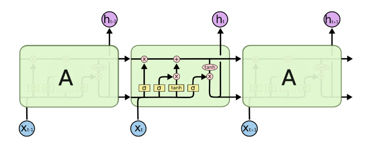
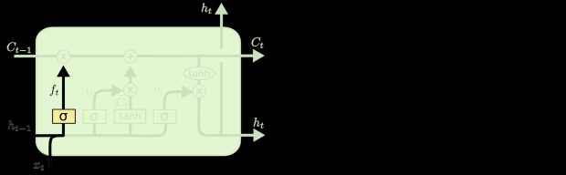
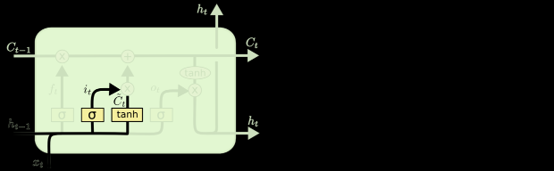

# ch06 深度学习用于文本和序列

用于处理序列的两种基本的深度学习算法：
- 循环神经网络（Recurrent Neural Network）
- 一维卷积神经网络（1D convnet）

算法的应用：
- 文档分类和时间序列分类
    - 识别文章的主题
    - 识别书的作者
- 时间序列对比
    - 估测两个文档的相关程度
    - 估测两支股票行情的相关程度
- 序列到序列的学习
    - 英语翻译成法语
- 情感分析
    - 推文划分为正面或者负面
    - 电影评论的情感划分为正面或者负面
- 时间序列预测
    - 根据某地最近的天气数据来预测未来天气
    
## 6.1 处理文本数据

文本是最常用的序列数据之一，可以理解为字符序列或者单词序列，最常见的是单词级处理。

深度学习用于自然语言处理是将模式识别应用于单词、句子和段落，而没有像人类那样真正理解文本。

深度学习模型处理文本的首要工作是文本向量化，即将文本转换为数值张量。
- 将文本分割为单词，并且将每个单词转换为一个向量
- 将文本分割为字符，并且将每个字符转换为一个向量
- 提取单词或者字符的n-gram，并且将每个n-gram转换为一个向量。
    - n-gram 是多个连续单词或者字符的集合（n-gram 之间可以重叠）
    - n-gram 是从一个句子中提取的N个（或者更少）连续单词的集合。
    - 词袋（bag-of-words）是一种不保存顺序的分词方法（生成的标记组成一个集合，而不是一个序列，舍弃了句子的总体结构），
    因此词袋往往被用于浅层的语言处理模型，而不是深度学习模型（深度学习模型使用分层特征学习）。
        - 袋（bag）：是指处理的是标记组成的集合，而不是一个列表或者序列，即标记是没有特定的顺序。
        - 二元语法袋（bag-of-2-grams）
        - 三元语法袋（bag-of-3-grams）

将文本分解而成的单元（单词、字符或者 n-gram）叫做标记（token），
将文本分解成标记的过程叫做分词（tokenization）。
所有文本向量化的过程都是应用某种分词方案，然后将数值向量与生成的标记相关联。
这些向量组合成序列张量，然后被输入到深度神经网络中。
将向量与标记相关联的方法：
- 对标记做 One-Hot 编码
- 标记嵌入（Token Embedding）：通常只用于单词，故叫词嵌入（Word Embedding）。

### 6.1.1 单词和字符的 One-Hot 编码

- 单词级的 One-Hot 编码
- 字符级的 One-Hot 编码
- One-Hot 散列技巧（One-Hot Hashing Trick）：是 One-Hot 编码的一种变体。
    - 技巧说明：如果词表中标记的数量太多而无法直接处理，那么可以使用这个技巧来解决。
    不同于 One-Hot 编码为每个单词显式分配一个保存在字典中的索引，而是将单词散列编码为固定长度的向量，通常采用的编码工具是散列函数。
    - 优点：避免维护单词索引，节省内存，允许数据在线编码
    - 缺点：可能会出现散列冲突，即两个不同的单词可能具有相同的散列值，使得机器学习算法无法区分这两个单词。

### 6.1.2 使用词嵌入

词嵌入（Word Embedding）：使用密集的词向量，是低维的浮点数向量，是从数据中学习得到的。

获取词嵌入的两种方法：
- 利用Embedding层基于反向传播算法学习词嵌入：在完成主任务（比如：文档分类或者情感预测）的同时学习词嵌入。
一开始是随机的词向量 ，然后对这些词向量进行学习，其学习方式与学习神经网络的权重相同
- 预训练词嵌入（Pretained Word Embedding）：在专门的机器学习任务中预计算好词嵌入，然后将其加载到模型中。

### 6.1.3 从原始文本到词嵌入（整合在一起）

预训练词嵌入的性能要优于与任务一起学习的嵌入。

### 6.1.4 小结
- 将原始文本转换成神经网络能够处理的格式
- 使用 Keras 模型的 Embedding 层来学习针对特定任务的标记嵌入
- 使用预训练词嵌入在小型自然语言处理问题上可以获得额外的性能提升

## 6.2 理解循环神经网络

前馈网络（Feed Forward Network）：要想处理数据点的序列或者时间序列，需要向网络同时展示整个序列，
即将序列转换成单个数据点，然后一次性处理。

循环神经网络（RNN，Recurrent Neural Network）：遍历所有序列元素，并且保存一个状态，其中包含与已经查看内容相关的信息。
RNN是一类具有内部环的神经网络，数据点不再是在单个步骤中处理，而是网络内部会对序列元素进行遍历。

```python
# Listing 6-19：RNN 伪代码
state_t = 0
for input_t in input_sequence:
    output_t = f(input_t, state_t)
    state_t = output_t
```

```python
# Listing 6-20：更加详细的 RNN 伪代码
state_t=0
for input_t in input_sequence:
    output_t = activation(dot(W,input_t)+dot(U,state_t)+b)
    state_t = output_t
```

### 6.2.1 Keras 中的循环层

Keras 中的 SimpleRNN 层能够处理序列批量，而不是像 Numpy 示例中那样只能处理单个序列

SimpleRNN 运行的两种模式：
- 返回每个时间步连续输出的完整序列，即形状为（batch_size，timesteps，output_features）的三维张量
- 返回每个输入序列的最终输出，即形状为（batch_size，output_features）的二维张量

### 6.2.2 理解 LSTM 层和 GRU 层

梯度消失问题（Vanishing Gradient Problem）：在层数较多的非循环网络（即前馈网络）中，
随着层数的增加，网络最终变得无法训练，对于 SimpleRNN 网络也存在同样的问题。
使用 LSTM 可以解决这个问题， GRU 是对 LSTM 的进一步简化。

长短期记忆（LSTM，Long Short Term Memory）：增加了一种携带信息跨越多个时间步的方法。
先将信息保存以便后面使用，从而防止较早期的信号在处理过程中逐渐消失。
携带数据流是一种调节下一个输出和下一个状态的方法。
允许过去的信息稍后重新进入，从而解决梯度消失问题。
LSTM 不擅长分析全局的长期性结构，因此不适用于情感分析问题，而适用于问答系统和机器翻译。
```python
# Listing 6.25：LSTM 架构的详细伪代码
output_t=activation(dot(state_t,Uo)+dot(input_t,Wo)+doc(C-t,Vo)+bo)
i_t=activation(dot(state_t,Ui)+dot(input_t,Wi)+bi)
f_t=activation(dot(state_t,Uf)+dot(input_t,Wf)+bf)
k_t=activation(dot(state_t,Uk)+dot(input_t,Wk)+bk)
c_(t+1)=i_t*k_t+c_t*f_t
```


LSTM包括：遗忘门、输入门。
- 遗忘门：c_t*f_t是为了遗忘携带数据流中的不相关信息


- 输入门：i_t*k_t是为了提供关于当前的信息



注：LSTM的详细解释可以参考网络上的资料，书上的不是非常清楚。

### 6.2.4 小结
- 循环神经网络（RNN）的概念及其工作原理
- 长短期记忆（LSTM）的原理及其特点
- 使用 Keras 内置的 RNN 和 LSTM 来解决问题

## 6.3 循环神经网络的高级用法
- 门控循环单元（GRU，Gated Rrecurrent Unit）层：工作原理与 LSTM 相同。
只是做了部分简化，降低了计算代价，也降低了表示能力。
- 循环参数丢弃（Recurrent Dropout）：在循环层中使用 Dropout 可以降低过拟合
    - 对每个时间步使用相同的 dropout 掩码，可以让网络沿着时间正确地传播其学习误差，
    而随着时间随机变化的 dropout 掩码会破坏这个误差信号，并且不利于学习过程
    - Keras 循环层的两个与 dropout 相关的参数
        - dropout：浮点数，指定该层输入单元的 dropout 比率
        - recurrent_dropout：指定循环单元的 dropout 比率
- 循环层堆叠（Stacking Recurrent Layers）：增加网络的层数，可以提高网络的表示能力，需要更多的计算资源
    - 过拟合不是非常严重，可以放心地增大每层的大小，以进一步改进验证损失，但是会导致更高的计算成本
    - 模型增强一层后性能并没有显著改进，所以提高网络能力的回报在逐渐减小
- 双向循环层（Bidirectional Recurrent Layer）：将相同的信息以不同的方式呈现给循环网络，
可以提高网络精度并且缓解网络遗忘知识的问题。

## 6.3.8 使用双向 RNN

在机器学习中，如果一种数据表示不同但是有用，那么就值得加以利用，这种表示与其他表示的差异越大越好，
这种表示提供了查看数据的全新角度，抓住了数据中被其他方法忽略的内容，因此可以提高模型在某个任务上的性能。
这是集成（Ensembling）方法背后的直觉。

双向 RNN 正是利用这个直觉来提高正序 RNN 的性能，从两个方向查看数据，从而得到更加丰富的表示，
并且捕捉到仅仅使用正序 RNN 时可能忽略的一些模式。

### 6.3.9 更多尝试
- 在堆叠循环层中调节每层的单元个数
- 调节 RMSprop 优化器的学习率
- 使用 LSTM 层代替 GRU 层
- 在循环层上面尝试使用更大的密集连接回归器，即更大的 Dense 层或者 Dense 层的堆叠
- 在测试集上运行性能最佳的模型（即验证 MAE 最小的模型）

### 6.3.10 小结
- 建立一个基于常识的基准，用于判断新创建的模型是否有进步
- 先从简单的模型开始，以此证明增加计算代价是有意义的。
有时简单模型就是最佳的选择
- 如果时间顺序对数据很重要，那么循环网络是一种合适的选择。
可能会比那些将时间数据展平的模式性能会更好。
- 在循环网络中使用 dropout时，应该使用一个不随时间变化的 dropout 掩码与循环 dropout掩码
- 与单个 RNN 层相比，堆叠 RNN 层的表示能力更加强大，但是计算代价也更高。
- 双向 RNN 从两个方向上查看一个序列，对自然语言处理问题非常有用。
对于在序列数据中最近的数据比序列形状的数据包含更多的信息，那么这种方法的效果就不明显。
- 进一步的学习：循环注意（Recurrent Attention）和序列掩码（Sequence Masking）对于自然语言处理特别有用。

## 6.4 使用卷积神经网络处理序列数据

一维卷积神经网络与空洞卷积核（dilated kernel）一起使用可以处理时间序列数据，效果与RNN相似，计算代价小很多。

### 6.4.1 理解序列数据的一维卷积

一维卷积能够从时间序列数据中提取局部一维序列段（即子序列）。
识别序列中的局部模式，对每个序列段执行相同的输入变换，从而能够把句子中某个位置学习得到的模式应用到其他位置的模式识别中，
说明一维卷积具有时间上的平移不变性。

字符级的一维卷积神经网络能够学会单词构词法。

补充：这种特性对于中文分词也应该会比较不错的效果。详情参考论文：
- Wang C, Xu B. Convolutional Neural Network with Word Embeddings for Chinese Word Segmentation[C]. international joint conference on natural language processing, 2017: 163-172.

### 6.4.2 序列数据的一维池化

一维池化：从输入中提取一维序列段（即子序列），然后输出其最大值（最大池化）或者平均值（平均池化），用于降低一维输入的长度（子采样）。

### 6.4.4 结合 CNN 和 RNN 来处理长序列

一维卷积神经网络分别处理每个输入序列段，所以它对范围比较大时间步的顺序不敏感，对窗口内的时间步是敏感的，这点与 RNN 不同。
因此为了识别长期的模式，可以将许多卷积层和池化层堆叠在一直，上面的层能够观察不对劲原始输入中更长的序列段。
当然这个方法的效果并不太好，更棒的方式是 CNN 与 RNN 的结合，在 RNN 前面使用 CNN 作为预处理步骤。
对于那些非常长的，以至于 RNN 都无法有效处理的长序列特别有效。
通过 CNN 将长的序列转换为高级特征组成的更短的序列（下采样），从而有效提升 RNN 处理的质量和速度。

### 6.4.5 小结
- 二维卷积神经网络在二维空间中处理视觉模式
- 一维卷积神经网络在一维空间中处理时间模式
    - 架构：Conv1D层和MaxPooling1D层堆叠在一起，最后是一个全局池化运算或者展开操作
- 一维卷积神经网络可以作为 RNN 的预处理步骤，将长序列变成短序列，提取出有用的高级特征表示再交由 RNN 处理

## 本章小结
- 本章的技术
    - 文本分词
    - 词嵌入
    - 循环网络
    - RNN：更加强大的序列处理模型
        - 堆叠 RNN
        - 双向 RNN 
    - 一维卷积神经网络：处理时间序列
    - 一维卷积神经网络 + RNN：处理长序列
- RNN 的主要应用
    - 时间序列回归（“预测未来”）
    - 时间序列分类
    - 时间序列异常检测
    - 序列标记（找出句子中的人名或者日期）
- 一维卷积神经网络的主要应用
    - 机器翻译（序列到序列的卷积模型，例如：SliceNet）
    - 文档分类
    - 拼写校正
- 时间序列数据的整体顺序很重要，最近的数据比久远的数据包含更多的信息量，适合使用循环网络处理。
例如：天气温度监测数据
- 文本数据的整体顺序不重要，在句首发现的关键词与在句尾发现的关键词具有相同的意义，适合使用一维卷积神经网络处理。

 
